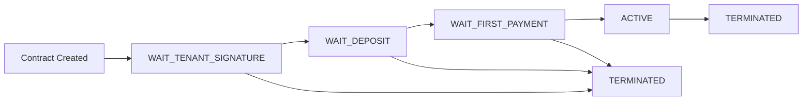
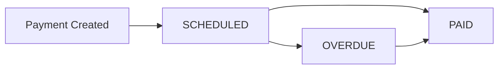

# Real Estate Smart Contract API Documentation
## Backend Service Integration Guide

### Version Information
- **Chaincode Name**: `real-estate-cc`
- **Version**: `2.0.0`
- **Description**: Real Estate Rental Smart Contract with enhanced security and data integrity
- **Network**: Hyperledger Fabric 2.5.12

---

## 📋 Table of Contents

1. [Contract Flow Overview](#contract-flow-overview)
2. [Status Transitions](#status-transitions)
3. [API Functions Reference](#api-functions-reference)
4. [Data Structures](#data-structures)
5. [Integration Guidelines](#integration-guidelines)
6. [Error Handling](#error-handling)
7. [Security Considerations](#security-considerations)
8. [Testing Scenarios](#testing-scenarios)

---

## 🔄 Contract Flow Overview

The Real Estate Smart Contract implements a comprehensive rental agreement lifecycle with the following key features:

### Core Features
- ✅ **Contract Management with MSP validation**
- ✅ **Payment Processing with integer amounts (cents/đồng)**
- ✅ **Composite keys for better performance**
- ✅ **Order reference uniqueness enforcement**
- ✅ **EOM-safe payment scheduling**
- ✅ **Automatic overdue detection**
- ✅ **Enhanced penalty system**
- ✅ **Private data collections support**

### Main Entities
- **Contract**: Core rental agreement
- **Payment**: Individual payment records
- **Penalty**: Violation records
- **Private Data**: Sensitive information (via private data collections)

---

## 📊 Status Transitions

### Contract Status Flow


### Status Details

| Status | Description | Next Possible Status | Required Action |
|--------|-------------|---------------------|------------------|
| `WAIT_TENANT_SIGNATURE` | Landlord has signed, waiting for tenant | `WAIT_DEPOSIT`, `TERMINATED` | Tenant signs contract |
| `WAIT_DEPOSIT` | Both parties signed, waiting for deposits | `WAIT_FIRST_PAYMENT`, `TERMINATED` | Both parties make deposits |
| `WAIT_FIRST_PAYMENT` | Deposits received, waiting for first rent | `ACTIVE`, `TERMINATED` | Tenant pays first month rent |
| `ACTIVE` | Contract is active and operational | `TERMINATED` | Normal operation or termination |
| `TERMINATED` | Contract has been terminated | - | Final state |

### Payment Status Flow


---

## 🔧 API Functions Reference

### Contract Management Functions

#### 1. CreateContract
**Purpose**: Create a new rental contract (landlord initiates)

**Parameters**:
```javascript
{
  contractId: string,           // Unique contract identifier
  landlordId: string,          // Landlord user ID
  tenantId: string,            // Tenant user ID  
  landlordMSP: string,         // "OrgLandlordMSP"
  tenantMSP: string,           // "OrgTenantMSP"
  landlordCertId: string,      // Landlord certificate ID
  tenantCertId: string,        // Tenant certificate ID
  signedContractFileHash: string, // Hash of landlord-signed contract file
  landlordSignatureMeta: string,  // JSON metadata about landlord signature
  rentAmount: string,          // Monthly rent (will be converted to cents/đồng)
  depositAmount: string,       // Security deposit (will be converted to cents/đồng)
  currency: string,            // "VND", "USD", "EUR", "SGD"
  startDate: string,           // ISO 8601 format
  endDate: string              // ISO 8601 format
}
```

**Example Call**:
```bash
peer chaincode invoke -C rentalchannel -n real-estate-cc \
  -c '{"function":"CreateContract","Args":[
    "contract-001",
    "landlord001", 
    "tenant001",
    "OrgLandlordMSP",
    "OrgTenantMSP",
    "landlord-cert-001",
    "tenant-cert-001",
    "hash123456",
    "{\"algorithm\":\"RSA-SHA256\",\"timestamp\":\"2025-09-27T10:00:00Z\",\"certId\":\"landlord-cert-001\"}",
    "15000000",
    "30000000", 
    "VND",
    "2025-01-01T00:00:00Z",
    "2025-12-31T23:59:59Z"
  ]}'
```

**Response**:
```json
{
  "objectType": "contract",
  "contractId": "contract-001",
  "landlordId": "landlord001",
  "tenantId": "tenant001",
  "status": "WAIT_TENANT_SIGNATURE",
  "rentAmount": 1500000000,
  "depositAmount": 3000000000,
  "currency": "VND",
  "signatures": {
    "landlord": {
      "metadata": {...},
      "signedBy": "landlord001",
      "signedAt": "2025-09-27T10:00:00Z",
      "status": "SIGNED"
    }
  },
  "createdAt": "2025-09-27T10:00:00Z"
}
```

#### 2. TenantSignContract
**Purpose**: Tenant signs the contract

**Parameters**:
```javascript
{
  contractId: string,
  fullySignedContractFileHash: string, // Hash of fully-signed contract file
  tenantSignatureMeta: string          // JSON metadata about tenant signature
}
```

**MSP Requirement**: Must be called from `OrgTenantMSP`

#### 3. RecordDeposit
**Purpose**: Record security deposits from both parties

**Parameters**:
```javascript
{
  contractId: string,
  party: string,        // "landlord" or "tenant"
  amount: string,       // Deposit amount (will be converted to cents/đồng)
  depositTxRef: string  // Transaction reference
}
```

#### 4. RecordFirstPayment
**Purpose**: Record the first month's rent payment

**Parameters**:
```javascript
{
  contractId: string,
  amount: string,       // Payment amount (must match rent amount)
  paymentTxRef: string  // Transaction reference
}
```

**MSP Requirement**: Must be called from `OrgTenantMSP`

#### 5. CreateMonthlyPaymentSchedule
**Purpose**: Generate monthly payment schedule based on first payment date

**Parameters**:
```javascript
{
  contractId: string
}
```

**Response**: Array of payment schedule objects with EOM-safe date calculation

### Query Functions

#### 1. GetContract
**Purpose**: Retrieve contract by ID

**Parameters**:
```javascript
{
  contractId: string
}
```

#### 2. QueryContractsByStatus
**Purpose**: Find contracts by status

**Parameters**:
```javascript
{
  status: string // "WAIT_TENANT_SIGNATURE", "WAIT_DEPOSIT", etc.
}
```

#### 3. QueryContractsByParty
**Purpose**: Find contracts for a specific landlord or tenant

**Parameters**:
```javascript
{
  partyId: string // landlord or tenant ID
}
```

#### 4. QueryContractsByDateRange
**Purpose**: Find contracts with overlapping date ranges

**Parameters**:
```javascript
{
  startDate: string,
  endDate: string
}
```

### Payment Management Functions

#### 1. RecordPayment
**Purpose**: Record monthly rent payment

**Parameters**:
```javascript
{
  contractId: string,
  period: string,       // Payment period number (2, 3, 4, etc.)
  amount: string,       // Payment amount
  orderRef: string      // Unique order reference (optional)
}
```

**MSP Requirement**: Must be called from `OrgTenantMSP`

#### 2. MarkOverdue
**Purpose**: Mark payment as overdue (automatic based on due date)

**Parameters**:
```javascript
{
  contractId: string,
  period: string
}
```

#### 3. ApplyPenalty
**Purpose**: Apply penalty to a specific payment

**Parameters**:
```javascript
{
  contractId: string,
  period: string,
  amount: string,       // Penalty amount
  policyRef: string,    // Policy reference (optional)
  reason: string        // Penalty reason (required)
}
```

#### 4. RecordPenalty
**Purpose**: Record contract-level penalty

**Parameters**:
```javascript
{
  contractId: string,
  party: string,        // "landlord" or "tenant"
  amount: string,       // Penalty amount
  reason: string        // Penalty reason (required)
}
```

### Utility Functions

#### 1. GetContractHistory
**Purpose**: Get complete transaction history for a contract

**Parameters**:
```javascript
{
  contractId: string
}
```

#### 2. StoreContractPrivateDetails
**Purpose**: Store sensitive contract details in private data collection

**Parameters**:
```javascript
{
  contractId: string,
  privateDataJson: string // JSON string with private details
}
```

#### 3. GetContractPrivateDetails
**Purpose**: Retrieve private contract details

**Parameters**:
```javascript
{
  contractId: string
}
```

---

## 🗂️ Data Structures

### Contract Object
```typescript
interface Contract {
  objectType: "contract";
  contractId: string;
  landlordId: string;
  tenantId: string;
  landlordMSP: string;
  tenantMSP: string;
  landlordCertId?: string;
  tenantCertId?: string;
  landlordSignedHash: string;
  fullySignedHash?: string;
  rentAmount: number;        // Integer (cents/đồng)
  depositAmount: number;     // Integer (cents/đồng)
  currency: string;
  startDate: string;         // ISO 8601
  endDate: string;           // ISO 8601
  status: ContractStatus;
  signatures: {
    landlord?: Signature;
    tenant?: Signature;
  };
  createdBy: string;
  createdByMSP: string;
  createdAt: string;         // ISO 8601
  updatedAt: string;         // ISO 8601
  activatedAt?: string;      // ISO 8601
  terminatedAt?: string;     // ISO 8601
  terminatedBy?: string;
  terminationReason?: string;
  summaryHash?: string;
  deposit: {
    landlord?: DepositRecord;
    tenant?: DepositRecord;
  };
  firstPayment?: PaymentRecord;
  penalties: PenaltyRecord[];
}
```

### Payment Object
```typescript
interface Payment {
  objectType: "payment";
  paymentId: string;
  contractId: string;
  period: number;
  amount: number;            // Integer (cents/đồng)
  status: "SCHEDULED" | "PAID" | "OVERDUE";
  dueDate?: string;          // ISO 8601
  orderRef?: string;
  paidAmount?: number;       // Integer (cents/đồng)
  paidBy?: string;
  paidAt?: string;           // ISO 8601
  overdueAt?: string;        // ISO 8601
  penalties?: PenaltyRecord[];
  createdAt: string;         // ISO 8601
  updatedAt: string;         // ISO 8601
}
```

### Supporting Types
```typescript
type ContractStatus = 
  | "WAIT_TENANT_SIGNATURE"
  | "WAIT_DEPOSIT" 
  | "WAIT_FIRST_PAYMENT"
  | "ACTIVE"
  | "TERMINATED";

interface Signature {
  metadata: any;
  signedBy: string;
  signedAt: string;         // ISO 8601
  status: "SIGNED";
}

interface DepositRecord {
  amount: number;           // Integer (cents/đồng)
  depositTxRef: string;
  depositedAt: string;      // ISO 8601
}

interface PaymentRecord {
  amount: number;           // Integer (cents/đồng)
  paymentTxRef: string;
  paidBy: string;
  paidAt: string;           // ISO 8601
}

interface PenaltyRecord {
  party?: "landlord" | "tenant";  // For contract penalties
  amount: number;           // Integer (cents/đồng)
  reason: string;
  policyRef?: string;
  appliedBy?: string;
  appliedAt?: string;       // ISO 8601
  timestamp?: string;       // ISO 8601 (for contract penalties)
}
```

---

## 🔗 Integration Guidelines

### 1. Backend Service Updates Required

#### API Endpoint Mapping
Your backend service should create these endpoints:

```javascript
// Contract Management
POST   /api/contracts                          // CreateContract
GET    /api/contracts/:contractId              // GetContract
PUT    /api/contracts/:contractId/tenant-sign  // TenantSignContract
PUT    /api/contracts/:contractId/deposit      // RecordDeposit
PUT    /api/contracts/:contractId/first-payment // RecordFirstPayment
POST   /api/contracts/:contractId/schedule     // CreateMonthlyPaymentSchedule
PUT    /api/contracts/:contractId/terminate    // TerminateContract

// Queries
GET    /api/contracts?status=:status           // QueryContractsByStatus
GET    /api/contracts?party=:partyId          // QueryContractsByParty
GET    /api/contracts?startDate=:start&endDate=:end // QueryContractsByDateRange

// Payments
POST   /api/payments                           // RecordPayment
PUT    /api/payments/:contractId/:period/overdue // MarkOverdue
PUT    /api/payments/:contractId/:period/penalty // ApplyPenalty

// Penalties
POST   /api/contracts/:contractId/penalties    // RecordPenalty

// Utilities
GET    /api/contracts/:contractId/history      // GetContractHistory
POST   /api/contracts/:contractId/private      // StoreContractPrivateDetails
GET    /api/contracts/:contractId/private      // GetContractPrivateDetails
```

#### Amount Handling
**CRITICAL**: All monetary amounts are stored as integers (cents/đồng)

```javascript
// Frontend sends: "15000000" (15,000,000 VND)
// Blockchain stores: 1500000000 (15,000,000 * 100 cents)
// Display: "15,000,000 VND"

// Conversion functions needed:
function toBlockchainAmount(displayAmount) {
  return Math.round(parseFloat(displayAmount) * 100);
}

function fromBlockchainAmount(blockchainAmount) {
  return (blockchainAmount / 100).toFixed(0);
}
```

#### MSP Authentication
Each organization must authenticate appropriately:

```javascript
// MSP mapping for API calls
const MSP_MAPPING = {
  'landlord': 'OrgLandlordMSP',
  'tenant': 'OrgTenantMSP', 
  'property-manager': 'OrgPropMSP'
};

// Functions requiring specific MSP:
const MSP_RESTRICTIONS = {
  'TenantSignContract': ['OrgTenantMSP'],
  'RecordFirstPayment': ['OrgTenantMSP'],
  'RecordPayment': ['OrgTenantMSP']
};
```

### 2. Database Schema Updates

#### New Contract Fields
```sql
ALTER TABLE contracts ADD COLUMN blockchain_amount_rent BIGINT;
ALTER TABLE contracts ADD COLUMN blockchain_amount_deposit BIGINT; 
ALTER TABLE contracts ADD COLUMN landlord_signed_hash VARCHAR(255);
ALTER TABLE contracts ADD COLUMN fully_signed_hash VARCHAR(255);
ALTER TABLE contracts ADD COLUMN landlord_signature_meta TEXT;
ALTER TABLE contracts ADD COLUMN tenant_signature_meta TEXT;
ALTER TABLE contracts ADD COLUMN activated_at TIMESTAMP;
ALTER TABLE contracts ADD COLUMN terminated_at TIMESTAMP;
ALTER TABLE contracts ADD COLUMN terminated_by VARCHAR(255);
ALTER TABLE contracts ADD COLUMN termination_reason TEXT;
ALTER TABLE contracts ADD COLUMN summary_hash VARCHAR(255);
```

#### Payment Tracking
```sql
CREATE TABLE contract_deposits (
  contract_id VARCHAR(255),
  party ENUM('landlord', 'tenant'),
  amount BIGINT,
  deposit_tx_ref VARCHAR(255),
  deposited_at TIMESTAMP,
  PRIMARY KEY (contract_id, party)
);

CREATE TABLE payment_schedules (
  payment_id VARCHAR(255) PRIMARY KEY,
  contract_id VARCHAR(255),
  period INT,
  amount BIGINT,
  status ENUM('SCHEDULED', 'PAID', 'OVERDUE'),
  due_date TIMESTAMP,
  order_ref VARCHAR(255) UNIQUE,
  paid_amount BIGINT,
  paid_by VARCHAR(255),
  paid_at TIMESTAMP,
  overdue_at TIMESTAMP,
  INDEX idx_contract_period (contract_id, period),
  INDEX idx_order_ref (order_ref)
);

CREATE TABLE penalties (
  id INT AUTO_INCREMENT PRIMARY KEY,
  contract_id VARCHAR(255),
  payment_id VARCHAR(255), -- NULL for contract-level penalties
  party ENUM('landlord', 'tenant'), -- For contract penalties
  amount BIGINT,
  reason TEXT,
  policy_ref VARCHAR(255),
  applied_by VARCHAR(255),
  applied_at TIMESTAMP,
  INDEX idx_contract (contract_id)
);
```

### 3. Event Handling

Your backend should listen for these blockchain events:

```javascript
const BLOCKCHAIN_EVENTS = {
  'ContractCreated': (event) => {
    // Update contract status in database
    // Send notifications to parties
  },
  
  'TenantSigned': (event) => {
    // Update signature status
    // Trigger deposit request notifications
  },
  
  'DepositRecorded': (event) => {
    // Update deposit records
    // Check if ready for first payment
  },
  
  'FirstPaymentRecorded': (event) => {
    // Activate contract
    // Generate payment schedules
  },
  
  'PaymentRecorded': (event) => {
    // Update payment status
    // Send confirmation
  },
  
  'PaymentOverdue': (event) => {
    // Send overdue notifications
    // Trigger penalty processes
  },
  
  'PenaltyApplied': (event) => {
    // Record penalty
    // Send notifications
  },
  
  'ContractTerminated': (event) => {
    // Update contract status
    // Process final settlements
  }
};
```

---

## ❌ Error Handling

### Common Error Scenarios

#### Contract Creation Errors
```javascript
// Missing required parameters
{
  error: "Missing required parameters for contract creation",
  code: "MISSING_PARAMS"
}

// Invalid currency
{
  error: "Currency SGD is not supported. Allowed: VND, USD, EUR, SGD",
  code: "INVALID_CURRENCY"
}

// Invalid date range
{
  error: "End date must be after start date", 
  code: "INVALID_DATE_RANGE"
}

// Contract already exists
{
  error: "Contract contract-001 already exists",
  code: "DUPLICATE_CONTRACT"
}
```

#### Status Transition Errors
```javascript
// Wrong status for operation
{
  error: "Contract is not waiting for tenant signature",
  code: "INVALID_STATUS"
}

// MSP validation failure
{
  error: "Caller MSP OrgPropMSP does not match expected tenant MSP OrgTenantMSP",
  code: "MSP_MISMATCH"
}
```

#### Payment Errors
```javascript
// Amount mismatch
{
  error: "Payment amount 1400000000 does not match rent amount 1500000000",
  code: "AMOUNT_MISMATCH"
}

// Duplicate order reference
{
  error: "Order reference ORDER123 is already used",
  code: "DUPLICATE_ORDER_REF"
}

// Payment not found
{
  error: "Payment schedule for contract contract-001 period 2 does not exist",
  code: "PAYMENT_NOT_FOUND"
}
```

### Backend Error Mapping
```javascript
const ERROR_MAPPING = {
  'MISSING_PARAMS': { status: 400, message: 'Bad Request: Missing required parameters' },
  'INVALID_CURRENCY': { status: 400, message: 'Bad Request: Invalid currency' },
  'INVALID_DATE_RANGE': { status: 400, message: 'Bad Request: Invalid date range' },
  'DUPLICATE_CONTRACT': { status: 409, message: 'Conflict: Contract already exists' },
  'INVALID_STATUS': { status: 422, message: 'Unprocessable Entity: Invalid status for operation' },
  'MSP_MISMATCH': { status: 403, message: 'Forbidden: Organization not authorized' },
  'AMOUNT_MISMATCH': { status: 422, message: 'Unprocessable Entity: Payment amount mismatch' },
  'DUPLICATE_ORDER_REF': { status: 409, message: 'Conflict: Order reference already used' },
  'PAYMENT_NOT_FOUND': { status: 404, message: 'Not Found: Payment not found' }
};
```

---

## 🔒 Security Considerations

### 1. MSP-Based Access Control
- Functions have MSP restrictions enforced at smart contract level
- Backend must validate user organization before making blockchain calls
- Private data collections restrict access by MSP membership

### 2. Data Integrity
- All monetary amounts stored as integers to prevent precision issues
- Contract file hashes ensure document integrity
- Signature metadata provides non-repudiation

### 3. Business Logic Validation
- Status transitions are enforced by smart contract
- Payment amounts must match scheduled amounts
- Date validations prevent invalid contracts

### 4. Private Data Handling
```javascript
// Sensitive data goes to private collections
const PRIVATE_DATA_EXAMPLES = {
  propertyDetails: {
    address: "123 Main St, Ho Chi Minh City",
    area: "75m2", 
    furnished: true
  },
  specialTerms: "Pet allowed with additional deposit",
  emergencyContact: "0123456789",
  personalIdentification: {
    landlordId: "ID123456789",
    tenantId: "ID987654321"
  }
};
```

---

## 🧪 Testing Scenarios

### Complete Flow Test Sequence

#### 1. Contract Creation Flow
```bash
# Test 1: Create contract
./cc-invoke.sh CreateContract "contract-001" "landlord001" "tenant001" "OrgLandlordMSP" "OrgTenantMSP" "landlord-cert-001" "tenant-cert-001" "hash123456" '{"algorithm":"RSA-SHA256"}' "15000000" "30000000" "VND" "2025-01-01T00:00:00Z" "2025-12-31T23:59:59Z"

# Expected: status = "WAIT_TENANT_SIGNATURE"
```

#### 2. Signature Flow
```bash
# Test 2: Tenant signs (must use OrgTenantMSP)
./cc-invoke.sh TenantSignContract "contract-001" "full_hash123456" '{"algorithm":"RSA-SHA256"}'

# Expected: status = "WAIT_DEPOSIT"
```

#### 3. Deposit Flow
```bash
# Test 3: Record deposits
./cc-invoke.sh RecordDeposit "contract-001" "landlord" "30000000" "deposit_tx_001"
./cc-invoke.sh RecordDeposit "contract-001" "tenant" "30000000" "deposit_tx_002"

# Expected: status = "WAIT_FIRST_PAYMENT"
```

#### 4. Payment Activation Flow
```bash
# Test 4: First payment (must use OrgTenantMSP)
./cc-invoke.sh RecordFirstPayment "contract-001" "15000000" "payment_tx_001"

# Expected: status = "ACTIVE"
```

#### 5. Monthly Schedule Flow
```bash
# Test 5: Generate schedule
./cc-invoke.sh CreateMonthlyPaymentSchedule "contract-001"

# Expected: Payment schedules created with EOM-safe dates
```

#### 6. Regular Operations Flow
```bash
# Test 6: Monthly payment
./cc-invoke.sh RecordPayment "contract-001" "2" "15000000" "ORDER_REF_002"

# Test 7: Apply penalty
./cc-invoke.sh ApplyPenalty "contract-001" "3" "500000" "LATE_POLICY" "5 days overdue"

# Test 8: Contract penalty
./cc-invoke.sh RecordPenalty "contract-001" "tenant" "1000000" "Noise violation"
```

### Query Testing
```bash
# Test queries
./cc-query.sh QueryContractsByStatus "ACTIVE"
./cc-query.sh QueryContractsByParty "tenant001"
./cc-query.sh QueryPaymentsByStatus "OVERDUE"
./cc-query.sh GetContract "contract-001"
./cc-query.sh GetContractHistory "contract-001"
```

### Error Case Testing
```bash
# Test error cases
./cc-invoke.sh CreateContract "contract-001" ... # Should fail: duplicate
./cc-invoke.sh TenantSignContract "nonexistent" ... # Should fail: not found
./cc-invoke.sh RecordPayment "contract-001" "999" ... # Should fail: payment not scheduled
```

---

## 📝 Implementation Checklist

### Backend Development Tasks

#### ✅ Database Updates
- [ ] Add new contract fields for blockchain amounts
- [ ] Create deposit tracking table
- [ ] Create payment schedule table  
- [ ] Create penalties table
- [ ] Add indexes for efficient queries
- [ ] Update existing queries to handle new fields

#### ✅ API Development
- [ ] Implement contract management endpoints
- [ ] Add MSP-based authentication middleware
- [ ] Create amount conversion utilities
- [ ] Implement event listeners for blockchain events
- [ ] Add comprehensive error handling
- [ ] Create private data management endpoints

#### ✅ Business Logic Updates  
- [ ] Update contract creation flow
- [ ] Implement signature workflow
- [ ] Add deposit tracking logic
- [ ] Create payment schedule generation
- [ ] Implement penalty management
- [ ] Add contract termination handling

#### ✅ Testing & Validation
- [ ] Unit tests for all API endpoints
- [ ] Integration tests with blockchain
- [ ] Error scenario testing
- [ ] Performance testing with large datasets
- [ ] Security testing for MSP restrictions
- [ ] End-to-end workflow testing

#### ✅ Documentation & Deployment
- [ ] API documentation updates
- [ ] Database migration scripts
- [ ] Deployment guides
- [ ] Rollback procedures
- [ ] Monitoring and alerting setup

---

## 🚀 Next Steps

1. **Review this documentation** with your development team
2. **Update database schema** according to the specifications
3. **Implement API endpoints** with proper MSP authentication
4. **Set up event listeners** for blockchain events  
5. **Test thoroughly** using the provided test scenarios
6. **Deploy incrementally** with proper rollback capabilities
7. **Monitor and optimize** performance after deployment

---

## 📞 Support & Questions

For questions about this integration:

1. **Smart Contract Issues**: Check the contract logs and ensure proper MSP setup
2. **API Integration**: Verify MSP authentication and parameter formatting
3. **Data Conversion**: Ensure proper integer conversion for monetary amounts
4. **Event Handling**: Confirm event listener configuration and processing

---

**Document Version**: 1.0  
**Last Updated**: September 27, 2025  
**Smart Contract Version**: 2.0.0